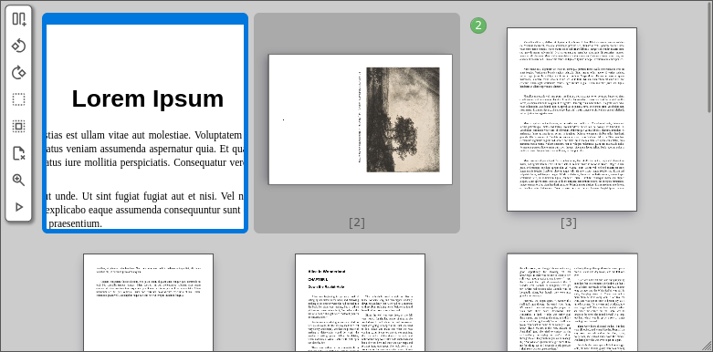

# pdf-reorganizer



pdf-reorganizer is a web component to help rearrange and split PDFs.
It does not modify PDF documents itself, but creates a [processing instruction](#processing-instructions)
that can be implemented independent of PDF processing APIs or programming languages. 
pdf-reorganizer is heavily inspired by [PDF-Arranger](https://github.com/pdfarranger/pdfarranger)
and is based on [PDF.js](https://github.com/mozilla/pdf.js).

Reorganization supports:
- Splits
- Removals
- Movements
- Rotations

# Integration

Install the package:

```shell
npm i pdf-reorganizer
```

Import the package in your code:

```html
<html>
  <head>
    <script type="module">
      import 'pdf-reorganizer';
    </script>
  </head>
  <body>
    <pdf-reorganizer url="example.pdf"></pdf-reorganizer>
  </body>
</html>
```

# Usage

# Key Bindings

In Reorganizer Viewport:

| Key    | Modifier   | Command |
|--------|------------|---------|
| right  |            | Move cursor to next page |
| left   |            | Move cursor to previous page |
| top    |            | Move cursor to page above in viewport |
| down   |            | Move cursor to page below in viewport |
| right  | Ctrl       | Rotate page on cursor position 90deg clockwise |
| left   | Ctrl       | Rotate page on cursor position 90deg counter clockwise |
| right  | Ctrl+Shift | Rotate selected pages 90deg clockwise |
| left   | Ctrl+Shift | Rotate selected pages 90deg counter clockwise |
| right  | Alt        | Choose preceding target to move selected pages (requires confirmation) |
| left   | Alt        | Choose following target to move selected pages (requires confirmation) |
| Delete |            | Remove page on cursor position (If no cursor exists, remove all selected) |
| Delete | Shift      | Remove all selected pages |
| Space  |            | Add page on cursor to the selection or remove from it |
| s      | Ctrl       | Add split before page on cursor (If no cursor exists, add split before selected pages) |
| s/S    | Ctrl+Shift | Add split before selected pages |
| +      | Ctrl       | Open magnified view on cursor |
| a      | Ctrl       | Select all pages |
| d      | Ctrl       | Unselect all pages |
| i/I    | Ctrl+Shift | Inverse select all pages |
| c      | Ctrl       | Add comment to the page on cursor or edit |
| Enter  |            | Confirm moving selected pages |

In magnified view:

| Key    | Modifier   | Command |
|--------|------------|---------|
| right  |            | Move viewport right |
| left   |            | Move viewport left |
| top    |            | Move viewport up |
| down   |            | Move viewport down |
| right  | Ctrl       | Move viewport to the right |
| left   | Ctrl       | Move viewport to the left |
| top    | Ctrl       | Move viewport to up |
| down   | Ctrl       | Move viewport to bottom |
| Escape |            | Leave magnifier view |

# Processing instructions

After reorganizing all pages into new documents, the `processed` custom event is dispatched.
This event can be listened on and contains a `docs` list and a `src` list in its `detail`
object.

```json
{
  "src" : [
    "mysimple.pdf"
  ],
  "docs" : [
    [1, 2],
    [3, { "p":5, "r":90 }],
    [{
      "p":6,
      "c":"This is a comment"
    }]
  ]
}
```

The `docs` array contains a list of documents resulting from the reorganization of the
source documents (listed in `src`). Each document is represented by a list of page
numbers.

If pages were modified or annotated, they are represented as a map with the following
keys supported:

`p`: Mandatory. The page number.

`r`: Optional. The page was rotated (clockwise by 90, 180 or 270 degrees).

`c`: Optional. A comment on the page.

`s`: Optional. The index to the source document in the `src` list. Defaults to `0`.


# Customization

## Configuration

The following parameters can be defined as part of the pdf-reorganizer element.

| Attribute    | Description |
|--------------|-------------|
| `url`        | The url of the PDF document. Mandatory.|
| `zoomfactor` | The scale for the magnifier view. Defaults to 6.|
| `scrollstep` | The number of pixels to scroll by arrow keys in magnifier view. Defaults to 14.|


## Styling

The following CSS variables can be overwritten and are resepected by the web component.
It's best to overwrite them in a `pdf-reorganizer` selector rule.

```css
pdf-reorganizer {

  /* Main color for fonts and borders */
  --pdfro-main-color: #555;
  
  /* Colors for selected pages */
  --pdfro-selected-color: #fff;
  --pdfro-selected-bg-color: #07d;
  
  /* Colors for the split marker */
  --pdfro-split-marker-border-color: #696;
  --pdfro-split-marker-bg-color: #6b6;
  --pdfro-split-marker-counter-color: #fff;

  /* Color of the load spinner */
  --pdfro-loader-color: blue;

  /* Color of removed pages */
  --pdfro-removed-bg-color: #777;

  /* Color of highlighted pages for mouseover */
  --pdfro-hover-bg-color: #aaa;
  
  /* Color of dragged pages and drag-markers */
  --pdfro-dragged-color: #7bf;

  /* Colors for navigation menu */
  --pdfro-nav-bg-color: #fff;
  --pdfro-nav-color: var(--pdfro-main-color);
}
```

# Planned Features
- Copy instead of moving
- Add files per drag and drop (if embedded in a service)
- Add select mode on long press (mousedown and touchstart)

# Known issues
- When height and width of a page are switches after rotation,
  the magnified view has an empty offset at the bottom of a page.
- hdpi doesn't properly work across browsers.

# License

This software bundles [Material Symbols](https://fonts.google.com/icons) from Google, published under the [Apache License 2.0](https://www.apache.org/licenses/LICENSE-2.0.html).
